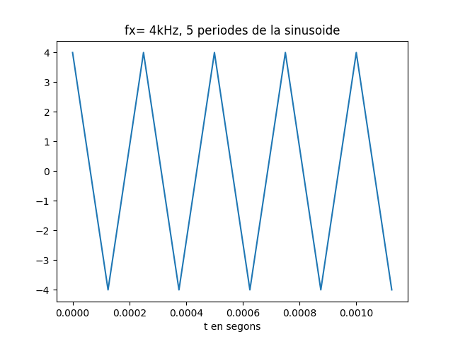
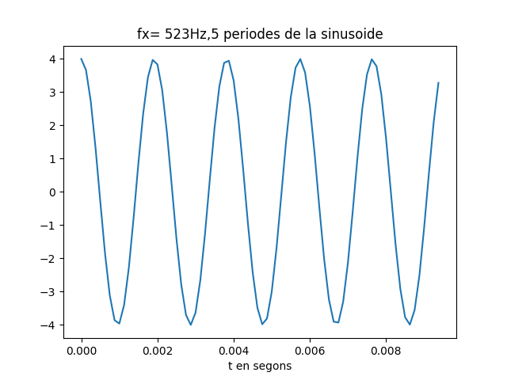
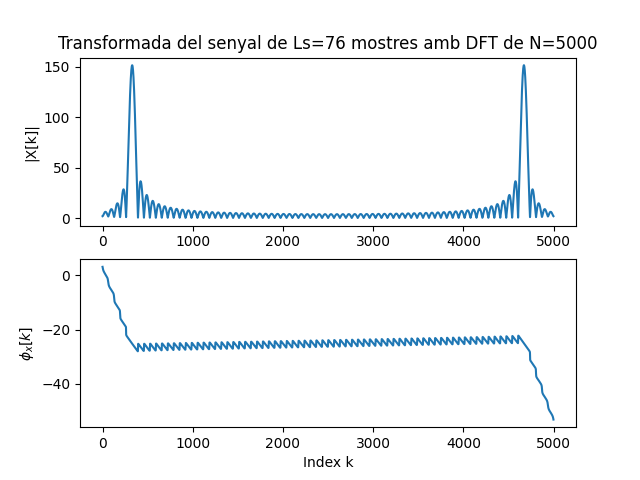
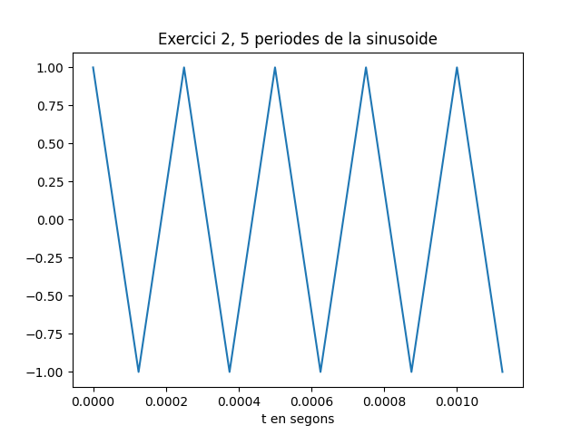
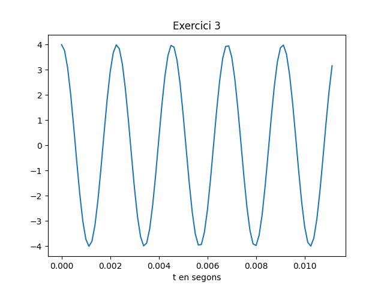
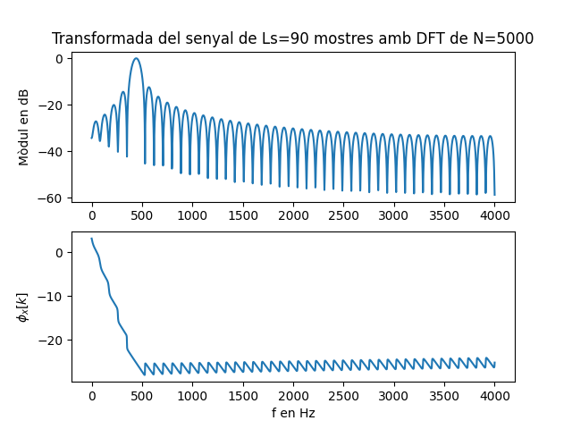
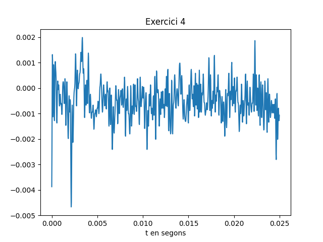
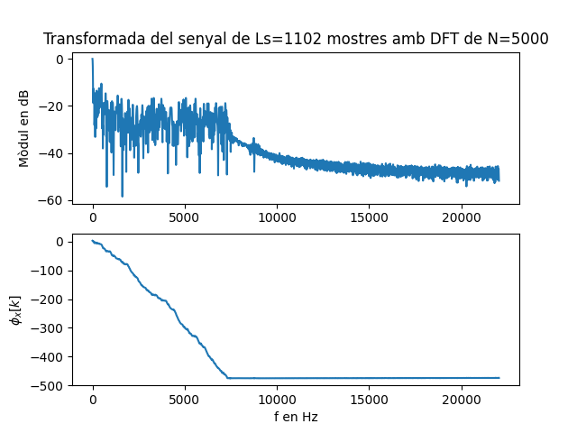

Primera tasca APA 2023: Anàlisi fitxer de so
============================================

## Nom i cognoms: Ada Salvador Avalos


## Representació temporal i freqüencial de senyals d'àudio.

### Domini temporal

Per llegir, escriure i representar un fitxer en format `*.wav` en python podem fem servir els següents mòduls:

- Numpy:
```python
import numpy as np
```
- Matplotlib: 
```python
import matplotlib.pyplot as plt
```
- Soundfile:
```python
import soundfile as sf
```

Per **crear** i **guardar** a un fitxer un senyal sinusoidal de freqüència `fx Hz`, digitalitzat a `fm Hz`, de durada `T` segons i amplitud 
`A` fem:

```python
T= 2.5                               # Durada de T segons
fm=8000                              # Freqüència de mostratge en Hz
fx=440                               # Freqüència de la sinusoide
A=4                                  # Amplitud de la sinusoide
pi=np.pi                             # Valor del número pi
L = int(fm * T)                      # Nombre de mostres del senyal digital
Tm=1/fm                              # Període de mostratge
t=Tm*np.arange(L)                    # Vector amb els valors de la variable temporal, de 0 a T
x = A * np.cos(2 * pi * fx * t)      # Senyal sinusoidal
sf.write('so_exemple1.wav', x, fm)   # Escriptura del senyal a un fitxer en format wav
```

El resultat és un fitxer guardat al directori de treball i que es pot reproduir amb qualsevol reproductor d'àudio

Per **representar** gràficament 5 períodes de senyal fem:

```python
Tx=1/fx                                   # Període del senyal
Ls=int(fm*5*Tx)                           # Nombre de mostres corresponents a 5 períodes de la sinusoide

plt.figure(0)                             # Nova figura
plt.plot(t[0:Ls], x[0:Ls])                # Representació del senyal en funció del temps
plt.xlabel('t en segons')                 # Etiqueta eix temporal
plt.title('5 periodes de la sinusoide')   # Títol del gràfic
plt.show()                                # Visualització de l'objecte gràfic. 
```

El resultat del gràfic és:


> Nota: Si es treballa amb ipython, es pot escriure %matplotlib i no cal posar el plt.show() per veure gràfics

El senyal es pot **escoltar (reproduir)** directament des de python important un entorn de treball amb els dispositius de so, com per 
exemple `sounddevice`:

```python
import sounddevice as sd      # Importem el mòdul sounddevice per accedir a la tarja de so
sd.play(x, fm)                # Reproducció d'àudio
```

### Domini transformat

Domini transformat. Els senyals es poden analitzar en freqüència fent servir la Transformada Discreta de Fourier. 

La funció que incorpora el paquet `numpy` al submòdul `fft` és `fft`:

```python
from numpy.fft import fft     # Importem la funció fft
N=5000                        # Dimensió de la transformada discreta
X=fft(x[0 : Ls], N)           # Càlcul de la transformada de 5 períodes de la sinusoide
```

I podem representar el mòdul i la fase, en funció de la posició de cada valor amb:

```python
k=np.arange(N)                        # Vector amb els valors 0≤  k<N

plt.figure(1)                         # Nova figura
plt.subplot(211)                      # Espai per representar el mòdul
plt.plot(k,abs(X))                    # Representació del mòdul de la transformada
plt.title(f'Transformada del senyal de Ls={Ls} mostres amb DFT de N={N}')   # Etiqueta del títol
plt.ylabel('|X[k]|')                  # Etiqueta de mòdul
plt.subplot(212)                      # Espai per representar la fase
plt.plot(k,np.unwrap(np.angle(X)))    # Representació de la fase de la transformad, desenroscada
plt.xlabel('Index k')                 # Etiqueta de l'eix d'abscisses 
plt.ylabel('$\phi_x[k]$')             # Etiqueta de la fase en Latex
plt.show()                            # Per mostrar els grafics
```


Proves i exercicis a fer i entregar
-----------------------------------

1. Reprodueix l'exemple fent servir diferents freqüències per la sinusoide. Al menys considera $f_x = 4$ kHz, a banda d'una freqüència pròpia en el marge audible. Comenta els resultats.
```python
# Amb 4kHz
T= 2.5                               
fm=8000                              
fx=4000                              
A=4                                  
pi=np.pi                            
L = int(fm * T)                      
Tm=1/fm                              
t=Tm*np.arange(L)                    
x = A * np.cos(2 * pi * fx * t)      
sf.write('nom_fitxer1.wav', x, fm)   
Tx=1/fx                                   
Ls=int(fm*5*Tx)                           

plt.figure(111)                            
plt.plot(t[0:Ls], x[0:Ls])                
plt.xlabel('t en segons')                 
plt.title('fx= 4kHz, 5 periodes de la sinusoide')   
plt.show()                                
```


```python
sd.play(x, fm)    


N=5000                       
X=fft(x[0 : Ls], N)           
k=np.arange(N)                       
plt.figure(112)                         
plt.subplot(211)                      
plt.plot(k,abs(X))                    
plt.title(f'Transformada del senyal de Ls={Ls} mostres amb DFT de N={N}')   
plt.ylabel('|X[k]|')                  
plt.subplot(212)                      
plt.plot(k,np.unwrap(np.angle(X)))    
plt.xlabel('Index k')                 
plt.ylabel('$\phi_x[k]$')             
plt.show() 
```


```python
# Amb 523Hz 
T= 2.5                              
fm=8000                            
fx=523                              
A=4                               
pi=np.pi                            
L = int(fm * T)                      
Tm=1/fm                              
t=Tm*np.arange(L)                    
x = A * np.cos(2 * pi * fx * t)     
sf.write('nom_fitxer2.wav', x, fm)   
Tx=1/fx                                  
Ls=int(fm*5*Tx)                          

plt.figure(121)                             
plt.plot(t[0:Ls], x[0:Ls])                
plt.xlabel('t en segons')                
plt.title('fx= 523Hz,5 periodes de la sinusoide')   
plt.show()                              
```


```python
sd.play(x, fm)    


N=5000                        
X=fft(x[0 : Ls], N)           
k=np.arange(N)                      
plt.figure(122)                        
plt.subplot(211)                      
plt.plot(k,abs(X))                   
plt.title(f'Transformada del senyal de Ls={Ls} mostres amb DFT de N={N}')   
plt.ylabel('|X[k]|')               
plt.subplot(212)                     
plt.plot(k,np.unwrap(np.angle(X)))  
plt.xlabel('Index k')                 
plt.ylabel('$\phi_x[k]$')             
plt.show() 
```
 

**Comentari**

En el primer cas, hem pogut observar que 5 períodes duren aproximadament 1ms i amb una amplitud de 4ms.
La seva transformada és una sinc de amb el mòdul de 40. El nombre de mostres en aquest cas és de 10 als 5 períodes.

En el segon cas a la primera gràfica en funció de temps veiem que 5 períodes duren 8ms i amb una amplitud de 4ms.
La seva transformada postra dos polsos amb el mòdul a aproximadament 150. El nombre mostres en aquest cas es 76 en els 5 períodes.

2. Modifica el programa per considerar com a senyal a analitzar el senyal del fitxer wav que has creat 
    (`x_r, fm = sf.read('nom_fitxer.wav')`).

```python
x_r, fm=sf.read('nom_fitxer1.wav')         #agafo la senyal del segon fitxer creat en el exercici anterior, agafo la seva
#informació i la fm
Tm=1/fm                            
t=Tm* np.arange(len(x_r))               
sf.write('nom_fitxerej2.wav', x_r, fm) 
```
    - Insereix a continuació una gràfica que mostri 5 períodes del senyal i la seva transformada.

```python
fx=fm/2
Tx=1/fx                                   # Període del senyal
Ls=int(fm*5*Tx)                           # Nombre de mostres corresponents a 5 períodes de la sinusoide

plt.figure(21)                             
plt.plot(t[0:Ls], x_r[0:Ls])                
plt.xlabel('t en segons')              
plt.title('Exercici 2, 5 periodes de la sinusoide')   
plt.show()                              
```
 

```python

sd.play(x_r, fm)    

N=5000                       
X=fft(x_r[0 : Ls], N)         
k=np.arange(N)                        
plt.figure(22)                        
plt.subplot(211)                     
plt.plot(k,abs(X))                   
plt.title(f'Transformada del senyal de Ls={Ls} mostres amb DFT de N={N}')   
plt.ylabel('|X[k]|')                 
plt.subplot(212)                      
plt.plot(k,np.unwrap(np.angle(X)))   
plt.xlabel('Index k')               
plt.ylabel('$\phi_x[k]$')             
plt.show()    
```
 


**- Explica el resultat del apartat anterior.**

He utilitzat el senyal del fitxer que he creat amb fx= 4kHz, així podem observar que el resultat és el mateix que a l'apartat d'on he llegit el fitxer. Ja que també he decidit mirar 5 períodes i tant la informació com la freqüència de la sinosoide és la mateixa.


3. Modifica el programa per representar el mòdul de la Transformada de Fourier en dB i l'eix d'abscisses en el marge de
    $0$ a $f_m/2$ en Hz.

```python

T= 2.5                               
fm=8000                             
fx=440                               
A=4                                  
pi=np.pi                           
L = int(fm * T)                     
Tm=1/fm                              
t=Tm*np.arange(L)                   
x = A * np.cos(2 * pi * fx * t)     
sf.write('nom_fitxerej3.wav', x, fm)  
Tx=1/fx                                   
Ls=int(fm*Tx*5)                           

plt.figure(31)                             
plt.plot(t[0:Ls], x[0:Ls])               
plt.xlabel('t en segons')                 
plt.title('Exercici 3')  
plt.show()                                
```
 

```python


sd.play(x, fm)    


N=5000                        
X=fft(x[0 : Ls], N)        
k=np.arange(N)                                            
plt.figure(32)                         
GdB = 20*np.log10(np.abs(X)/max(np.abs(X)))
fk = k[0:N//2+1]*fm/N         #Calcul de la fk, pels valors de l'eix d'abscisses
plt.subplot(211)   
plt.plot(fk,GdB[0:N//2+1])  # Representació del mòdul de la transformada en dB y de 0 a FK/2
plt.title(f'Transformada del senyal de Ls={Ls} mostres amb DFT de N={N}')   
plt.ylabel('Mòdul en GdB')                  
plt.subplot(212)                      
plt.plot(fk,np.unwrap(np.angle(X[0:N//2+1])) )   
plt.xlabel('f en Hz')                
plt.ylabel('$\phi_x[k]$')              
plt.show() 
 
```
 

**- Comprova que la mesura de freqüència es correspon amb la freqüència de la sinusoide que has fet servir.**

**- Com pots identificar l'amplitud de la sinusoide a partir de la representació de la transformada.Comprova-ho amb el senyal generat.**

No es pot fer perquè al normalitzar pel màxim dóna un 1.

> NOTES:
>
> - Per representar en dB has de fer servir la fórmula següent:
>
> $X_{dB}(f) = 20\log_{10}\left(\frac{\left|X(f)\right|}{\max(\left|X(f)\right|}\right)$
>
> - La relació entre els valors de l'índex k i la freqüència en Hz és:
>
> $f_k = \frac{k}{N} f_m$

4. Tria un fitxer d'àudio en format wav i mono (el pots aconseguir si en tens amb altres formats amb el programa Audacity). 
    Llegeix el fitxer d'àudio i comprova:

    - Freqüència de mostratge.
    - Nombre de mostres de senyal.
    - Tria un segment de senyal de 25ms i insereix una gráfica amb la seva evolució temporal.
    - Representa la seva transformada en dB en funció de la freqüència, en el marge $0\le f\le f_m/2$.
 
```python
T= 0.025                               
data, fm =sf.read('luzbel44.wav')       
L = int(fm * T)                     
Tm=1/fm                            
t=Tm*np.arange(L)                  
sf.write('nom_fitxerej4.wav', data, fm)  

plt.figure(41)                          
plt.plot(t[0:L],data[0:L])              
plt.xlabel('t en segons')               
plt.title('Exercici 4')  
plt.show()                             
```
 

```python

N=5000                        
X=fft(data[0 : L], N)    
k=np.arange(N)                                         
plt.figure(42)                         
GdB = 20*np.log10(np.abs(X)/max(np.abs(X)))
fk = k[0:N//2+1]*fm/N
plt.subplot(211)   
plt.plot(fk,GdB[0:N//2+1])  # Representació del mòdul de la transformada en dB y de 0 a FK/2
plt.title(f'Transformada del senyal de Ls={L} mostres amb DFT de N={N}')   
plt.ylabel('Mòdul en GdB')                   
plt.subplot(212)                      
plt.plot(fk,np.unwrap(np.angle(X[0:N//2+1])) )   
plt.xlabel('f en Hz')                
plt.ylabel('$\phi_x[k]$')          
plt.show() 

```
 


**- Quines son les freqüències més importants del segment triat?**

En el segment que he triat les freqüències més importants son del 2kHz a 8kHz aproximadament.

Entrega
-------

- L'alumne ha de respondre a totes les qüestions formulades en aquest mateix fitxer, README.md.
    - El format del fitxer es l'anomenat *Markdown* que permet generar textos amb capacitats gràfiques (com ara *cursiva*, **negreta**,
      fòrmules matemàtiques, taules, etc.), sense perdre la llegibilitat en mode text.
    - Disposa d'una petita introducció a llenguatge de Markdown al fitxer `MARKDOWN.md`.
- El repositori GitHub ha d'incloure un fitxer amb tot el codi necesari per respondre les qüestions i dibuixar les gràfiques.
- El nom del fitxer o fitxers amb el codi ha de començar amb les inicials de l'alumne (per exemple, `fvp_codi.py`).
- Recordéu ficar el el vostre nom complet a l'inici del fitxer o fitxers amb el codi i d'emplar el camp `Nom i cognoms` a dalt de tot
  d'aquest fitxer, README.md.
